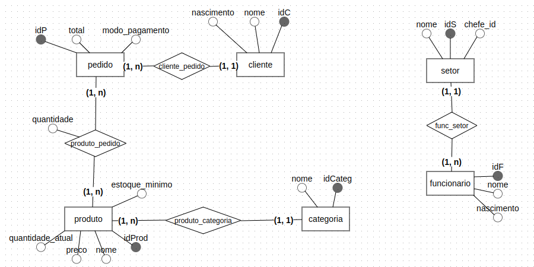
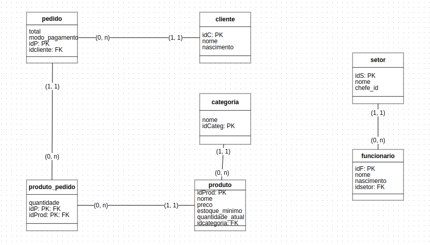

# Sales Analytics Model
## Objective
This project was built for improve business data management. The functionalities included are:

1. [x] Function/Trigger that calculates the total amount spent by each client;
2. [ ] Stored procedures for updating, inserting, and deleting tuples;
3. [ ] Trigger that alerts when stock levels are below the minimum required;
4. [ ] Views with key insights about the sales scenario.

## Conceptual Model

## Logical Model

